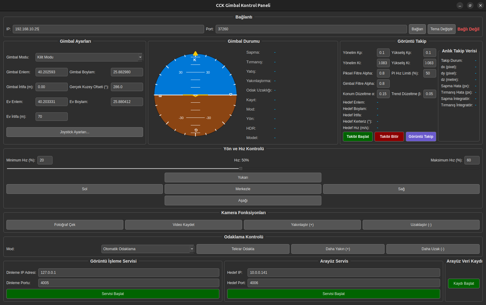

SIYI Gimbal Gelişmiş Kontrol Paneli
===================================

<p align="center">

<br/>
<em>SIYI gimbal kameraları için geliştirilmiş, CCK masaüstü kontrol yazılımı.</em>
</p>

Bu proje, SIYI gimbal kameralarını kontrol etmek, durumlarını anlık olarak izlemek ve gelişmiş görüntü tabanlı hedef takibi yapmak için [PyQt5](https://www.google.com/url?sa=E&q=https%3A%2F%2Fwww.qt.io%2Fqt-for-python) ile geliştirilmiş bir masaüstü kontrol paneli yazılımıdır. Yazılım, [mzahana/siyi_sdk](https://www.google.com/url?sa=E&q=https%3A%2F%2Fgithub.com%2Fmzahana%2Fsiyi_sdk) projesinin Python SDK'sını temel alır.

* * * * *

✨ Temel Özellikler
------------------

-   **🎮 Tam Gimbal Kontrolü:** Yön, hız, merkezleme ve mod değiştirme dahil olmak üzere tam manuel kontrol.

    -   **📊 Gerçek Zamanlı Durum Paneli:**

    -   Yapay ufuk göstergesi ile anlık **Yaw, Pitch ve Roll** açıları.

        -   Zoom seviyesi, hesaplanan odak uzaklığı, kayıt durumu, gimbal modu gibi detaylı telemetri verileri.

    -   **🎯 Gelişmiş Görüntü Takibi:**

    -   **İki Yönlü İletişim:** Harici bir görüntü işleme servisinden UDP üzerinden hedef verilerini (dx, dy, dz) alırken, aynı servise anlık **odak uzaklığı, zoom seviyesi ve sıfırlama komutları** gönderir.

        -   **PI Kontrolcü:** Ayarlanabilir **Kp ve Ki** kazançlarına sahip dahili PI kontrolcü ile hedefi otomatik olarak merkezde tutar.

        -   **Hedef Kinematiği:** Takip sırasında hedefin coğrafi koordinatlarını (**Enlem, Boylam, İrtifa**) anlık olarak hesaplar ve bu veriyi kullanarak hedefin **hızını ve hareket yönünü (kerteriz)** tahmin eder.

        -   **Gelişmiş Filtreleme:**

        -   Gimbal'den gelen ham açı verilerini ve gelen piksel hatalarını (dx, dy) yumuşatarak daha kararlı bir kontrol sağlar.

            -   Hesaplanan hedef konumu üzerinde **Çift Üstel Düzeltme (Holt's Method)** filtresi uygulayarak ani sıçramaları ve gürültüyü engeller.

    -   **🕹️ Kapsamlı Joystick Desteği:**

    -   Tüm eksen ve düğmeler için tamamen özelleştirilebilir Joystick yapılandırması.

        -   "Otomatik Algılama" özelliği ile kolay tuş ataması ve ayarlanabilir hız aralığı.

    -   **📸 Kamera Fonksiyonları:** Tek tuşla fotoğraf çekme, video kaydını başlatma/durdurma, hassas zoom ve odaklama kontrolü.

    -   **📡 Arayüz Servisi (Veri Yayınlama):**

    -   Gimbal ve hesaplanan hedef konum verilerini (enlem, boylam, irtifa, **hız, yön**) başka sistemlere (yer kontrol istasyonu, görev bilgisayarı) yayınlamak için dahili UDP servisi.

        -   Takip olmadığında, tanımlanmış **Ev Konumu**'nu yayınlama seçeneği.

    -   **📝 Kapsamlı Veri Kaydı (Logging):**

    -   Tek tuşla tüm sensör verilerini, PI kontrolcü durumunu, hesaplanan hedef kinematiğini ve arayüz ayarlarını zaman damgalı bir **.csv** dosyasına kaydeder.

        -   Performans analizi, hata ayıklama ve görev sonrası değerlendirme için idealdir.

    -   **💾 Kalıcı Yapılandırma:** Tüm arayüz ve joystick ayarlarını .json dosyalarına kaydederek ayarlarınızın kaybolmamasını sağlar.

    -   **🎨 Tema Desteği:** Göz yormayan **Koyu** ve aydınlık **Açık** tema seçenekleri.

* * * * *

🛠️ Kurulum ve Başlatma
-----------------------

### 1\. Donanım ve Ağ Yapılandırması

Öncelikle gimbal ve bilgisayarınız arasındaki fiziksel bağlantıyı kurun ve ağ ayarlarını yapın.

-   Gimbal'i kutu içeriğindeki Ethernet kablosuyla bilgisayarınıza bağlayın.

    -   Gimbal'e güç verin.

    -   Bilgisayarınızın kablolu ağ ayarlarından **Manuel (Statik) bir IP adresi** atayın.

    -   **Örnek IP:** 192.168.144.12

        -   **Ağ Geçidi:** 192.168.144.25

        -   **Ağ Maskesi:** 255.255.255.0

### 2\. Yazılım Gereksinimleri

Bu arayüz Python 3 ve birkaç ek kütüphane gerektirir.

```bash
git clone https://github.com/CiciKusRC/siyi_sdk.git
cd siyi_sdk

# Gerekli Python kütüphanelerini yükleyin
pip install PyQt5 pygame
```

### 3\. Uygulamayı Çalıştırma

Tüm dosyalar aynı dizindeyken, terminalden aşağıdaki komutu çalıştırın:

```bash
python gui.py
```

* * * * *

🚀 Hızlı Başlangıç
------------------

-   **Bağlanma:** Arayüzdeki "Bağlantı" bölümünde gimbal IP'sinin (192.168.144.25) doğru olduğunu kontrol edip **"Bağlan"** düğmesine tıklayın.

    -   **Manuel Kontrol:** "Yön ve Hız Kontrolü" bölümündeki tuşları veya yapılandırdığınız joystick'i kullanarak gimbal'i hareket ettirin.

    -   **Otomatik Takip:**

    -   "Görüntü İşleme Servisi" bölümünde, harici uygulamanızın veri göndereceği portu belirleyip **"Servisi Başlat"** deyin.

        -   Formatı belirtilen hedef verilerini bu porta göndermeye başlayın.

        -   "Görüntü Takip" bölümündeki **"Takibi Başlat"** düğmesine tıklayarak otomatik takibi etkinleştirin.

* * * * *

🛰️ Görüntü İşleme Entegrasyonu (İki Yönlü)
-------------------------------------------

Bu kontrol paneli, harici bir görüntü işleme uygulaması ile iki yönlü iletişim kuracak şekilde tasarlanmıştır.

### 1\. Veri Alma (Görüntü İşleme → Kontrol Paneli)

Kontrol panelinin hedefi takip edebilmesi için, ayrı bir uygulamanın (Python/OpenCV, C++, vb.) video akışını analiz etmesi ve aşağıdaki formatta UDP paketleri göndermesi gerekir.

-   **Veri Formatı:** UTF-8 ile kodlanmış JSON string.

    -   **Hedef Port:** Arayüzde yapılandırdığınız "Dinleme Portu".

#### Örnek JSON Verisi

```json
{
    "tracker_status": 1,
    "dx": 55,
    "dy": -23,
    "dz": 150.75
}
```

| Anahtar | Tip | Açıklama |
| --- | --- | --- |
| tracker_status | int | Hedefin takip durumu. 1: Takip Ediliyor, 0: Hedef Kayıp. |
| dx | int | Hedefin merkezden yatay piksel sapması. + sağda, - solda. |
| dy | int | Hedefin merkezden dikey piksel sapması. + aşağıda, - yukarıda. |
| dz | float | Kameranın hedefe olan tahmini mesafesi (metre). |

### 2\. Veri Gönderme (Kontrol Paneli → Görüntü İşleme)

Kontrol paneli, görüntü işleme uygulamasına yardımcı olmak için anlık kamera bilgilerini geri gönderir. Bu, görüntü işleme algoritmasının zoom seviyesi gibi değişkenlere adapte olmasını sağlar.

-   **Veri Formatı:** UTF-8 ile kodlanmış JSON string.

    -   **Hedef:** Veri gönderen istemcinin IP ve portuna otomatik olarak yanıt verilir.

#### Örnek JSON Yanıtı

```json
{
    "focal_length": 75.4,
    "zoom": 15.2,
    "gimbal_tracker_status": 1,
    "image_tracker_reset": 0
}
```

| Anahtar | Tip | Açıklama |
| --- | --- | --- |
| focal_length | float | Kameranın anlık hesaplanmış odak uzaklığı (mm). |
| zoom | float | Kameranın anlık zoom seviyesi (örn: 1.0x, 30.0x). |
| gimbal_tracker_status | int | Kontrol panelindeki otomatik takibin aktif olup olmadığı. 1: Aktif, 0: Pasif. |
| image_tracker_reset | int | Görüntü işleme algoritmasını sıfırlamak için gönderilen komut. 1: Sıfırlama isteği, 0: Normal çalışma. (Arayüzdeki buton ile tetiklenir). |

* * * * *

📡 Arayüz Servisi (Veri Yayınlama)
----------------------------------

Kontrol Paneli, işlediği ve hesapladığı kritik verileri bir Yer Kontrol İstasyonu (YKİ), görev bilgisayarı veya harita yazılımı gibi harici sistemlere yayınlayabilir.

### Veri Formatı

Gönderilen UDP paketleri, UTF-8 ile kodlanmış ve iki ana bölümden oluşan bir JSON objesi içerir: target ve gimbal.

-   **Takip Aktifken:** target objesi, hedefin hesaplanan anlık konumunu, hızını ve yönünü içerir.

    -   **Takip Pasifken:** target objesi, arayüzde tanımlanan **Ev Konumu**'nu içerir (target_status: 0).

#### Örnek JSON Verisi (Takip Aktifken)

```json
{
    "target": {
        "target_latitude": 39.925533,
        "target_longitude": 32.866287,
        "target_altitude": 950.25,
        "target_status": 1,
        "target_heading": 275.5,
        "target_velocity": 15.2
    },
    "gimbal": {
        "gimbal_latitude": 39.92077,
        "gimbal_longitude": 32.85411,
        "gimbal_altitude": 1100.0,
        "gimbal_heading": 135.42
    }
}
```

#### Alanların Açıklaması

| Anahtar (obje) | Anahtar (alan) | Tip | Açıklama |
| --- | --- | --- | --- |
| target | target_latitude | float | Hedefin hesaplanan enlemi (WGS84). |
|  | target_longitude | float | Hedefin hesaplanan boylamı (WGS84). |
|  | target_altitude | float | Hedefin hesaplanan irtifası (metre). |
|  | target_status | int | Hedef durumu. 1: Aktif olarak takip ediliyor, 0: Takip yok / Ev Konumu. |
|  | target_heading | float | Hedefin hesaplanan hareket yönü (Gerçek Kuzey'e göre açı, derece). |
|  | target_velocity | float | Hedefin hesaplanan hızı (m/s). |
| gimbal | gimbal_latitude | float | Gimbal'in (hava aracının) anlık enlemi. |
|  | gimbal_longitude | float | Gimbal'in (hava aracının) anlık boylamı. |
|  | gimbal_altitude | float | Gimbal'in (hava aracının) anlık irtifası (metre). |
|  | gimbal_heading | float | Gimbal'in baktığı yön (Gerçek Kuzey'e göre açı, derece). |

* * * * *

📝 Veri Kaydı (Logging)
-----------------------

Arayüz, "Arayüz Veri Kaydı" bölümündeki buton ile tüm operasyonel verileri zaman damgalı bir .csv dosyasına kaydetme özelliğine sahiptir. Bu özellik, görev sonrası analiz, PI kontrolcü performans ayarı veya hata ayıklama için son derece kullanışlıdır.

Kaydedilen bazı önemli veriler:

-   Ham gimbal açıları ve filtrelenmiş değerler

    -   Zoom seviyesi ve odak uzaklığı

    -   Gelen dx, dy, dz piksel verileri

    -   PI kontrolcünün anlık hata ve integral değerleri

    -   Hesaplanan hedef konumu (enlem, boylam, irtifa)

    -   Hesaplanan hedef kinematiği (hız, yön)

    -   Arayüzdeki tüm ayar parametreleri (Kp, Ki, filtre katsayıları vb.)

* * * * *

📹 Video Akışı (Referans)
-------------------------

Bu GUI video akışını doğrudan göstermez. Görüntü işleme uygulamanızın video akışını alması gerekir. SIYI kameralar genellikle **RTSP** üzerinden video yayını yapar.

-   **Örnek RTSP Adresi:** rtsp://192.168.144.25:8554/main.264

    -   OpenCV ile RTSP akışını almak için siyi_sdk projesinin tests/test_rtsp.py dosyasındaki örnekleri inceleyebilirsiniz.